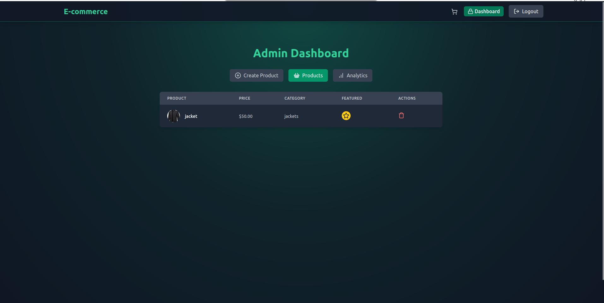

# E-Commerce Platform 

Welcome to the **E-Commerce Platform** repository! This project is a full-stack web application, developed using the **MERN stack** (MongoDB, Express.js, React, Node.js).  

This application allows users to have a greate online shopping exprince ,mimicking the functionality of known E-Commerce platforms. 


## Features  
- **Authentication**: Sign up and log in.


    
- **Categorical Splitting**: Every category have its own page.


- **Cart Page**: To review the order and its payments.
- **Copoun Discount**: Apply copouns to get discounts for your order.  

  
- **Admin Panel**: Admins can add or remove products from the store, make product as featured to make it appear at the home, and view analysis of the platform.




- **Purchases Response**: A success or Cancel Page that responds if the payment is done correctly or not. 


- **Safe Payment**: Integrate with strapi to make payment proccess east and safe.  
- **Responsive Design**: Fully optimized for both desktop and mobile devices.  

## Tech Stack  
### Frontend  
- **React.js**: For building a dynamic and interactive user interface.  

### Backend  
- **Node.js**: For handling server-side logic.  
- **Express.js**: For creating RESTful APIs.  

### Database  
- **MongoDB**: For storing user and post data.  
- **Cloudinary**: For storing images.  

### Authentication  
- **JWT (JSON Web Tokens)**: For secure user authentication.  

## Installation  

1. **Clone the Repository**  
   ```bash  
   git clone https://github.com/mohamedhisham404/e-commerce.git  
   cd e-commerce  

2. **Put Your Own .env File**
    ```bash 
    touch .env
    ```
    #### then open it with your favourite text editor and put these values
    ```bash
    PORT = 5000
    MONGO_URI = XXX
    JWT_SECRET=XXX
    CLOUDINARY_CLOUD_NAME = XXX
    CLOUDINARY_API_KEY = XXX
    CLOUDINARY_API_SECRET = XXX
    STRIPE_SECRET_KEY = XXX
    CLIENT_URL = http://localhost:5173
    ```
3. **Install The Dependencies**
    ```bash 
    npm run build
4. **Start The Application**   
    ```bash 
    npm start
    ```

